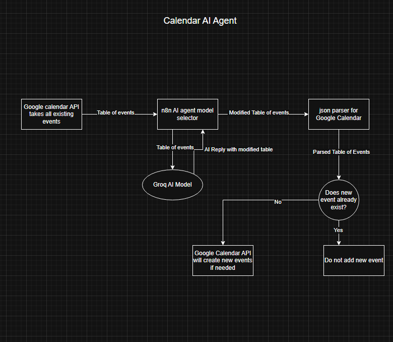
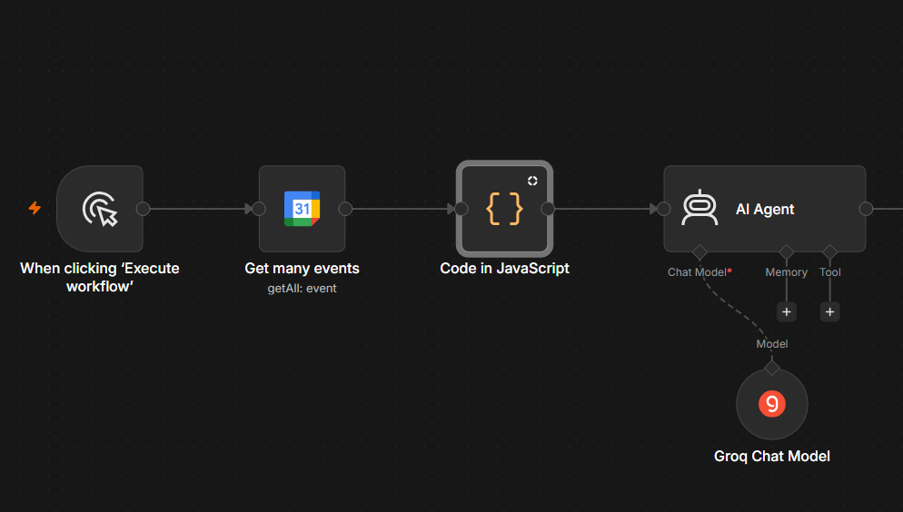
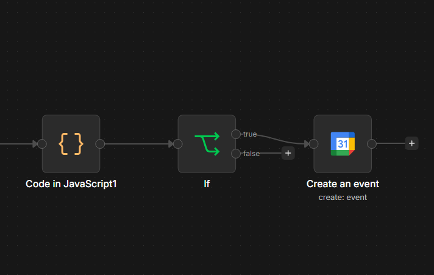
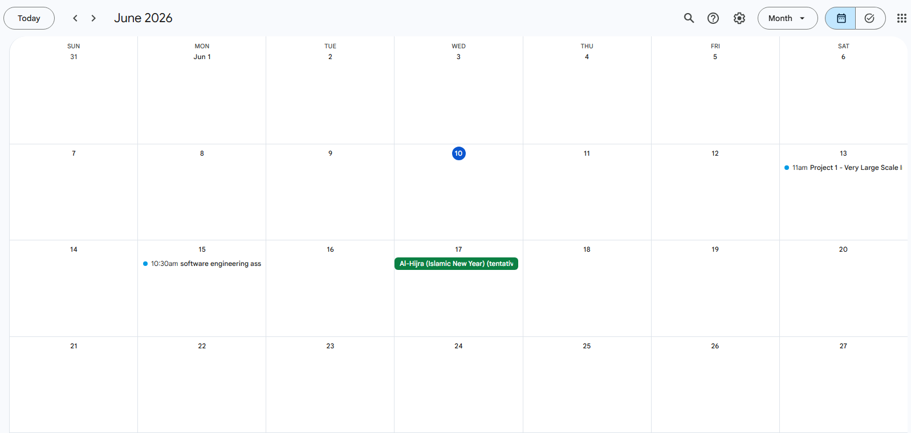
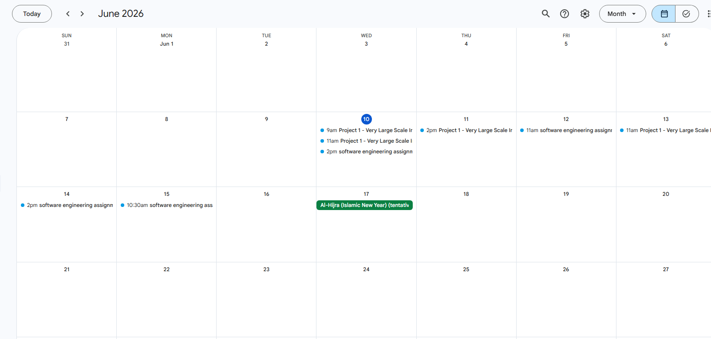

For this project, we were tasked with creating an AI agent that executes a specific task. We had the freedom of choosing what task the AI agent does. For me, I found difficulty in plan management and I struggle with deadlines so I decided to make an AI agent that can create new plans for me and manage my calendar.

**Problem statement:** The AI agent must be able to access and modify my personal calendar. It should not be able to remove/change existing events on the calendar without the user’s permission. The user can specify what times the milestones should be (time range). Everytime the workflow is executed, new plans may be added to the calendar as fit.

**Data flow:**  
  
**Input:**  
Google API json events table.  
**Output:**  
Modified Google API json event table with the new events if needed. ( No duplicate milestones will be added to the schedule).  
**AI model used:**  
**Groq openai/gpt-oss-20b**

## Functional Requirements:

The system must indicate clearly the scheduling timings, descriptions and titles of all events when requested.  
The system must Inquire AI agent to choose the best AI model for the task.  
The system must preserve the modified table of events from the result of the AI model inquiry.  
The user is allowed to specify which time ranges are suitable for milestones.  
The user must be able to request for new milestones IF none exist in the schedule.

## Non functional requirements:

The AI model should not take more than 3 seconds to send back a reply.  
The message token should not exceed the token limit set by Groq’s free version API.  
The workflow must have internet connection to execute.  
The total workflow execution time must not exceed 15 seconds.  
The system may only work locally so the host will have to be on for the duration of the execution of workflow.

## Software Development:

This project mainly revolved around the use of n8n framework to create an AI agent using their ready-made custom graphical user interface. This has simplified all the work effort needed to develop an AI model from scratch. The AI model of choice was Groq because it is fast and does not require subscription. The idea of the project is that the google calendar API would take all the existing events from my personal email and give it to the AI agent as a table. The AI agent would inquire about the AI model Groq along with the message “user prompt” where the user may choose explicitly which prompt they want Groq to follow. For this project, we had to make sure that the time formatting was correct and adding new events does not overlap with the existing ones. The checkpoints/milestones must be chronologically correct and their objectives must build on one another.  
**Initial Stage of Data manipulation**  

1) User presses “Execute Workflow” on the n8n localhost website.  
2) Google API gets all existing events  
3) Code transforms the resulting table into a json readable table for the AI model  
4) AI agent sends the table to the AI model alongside the user/system prompt.  
5) AI agent receives the modified table from the AI model

**Second Stage of Data manipulation and Event creation**  
****

6) Result of AI Agent is parsed back into readable javascript for the Google calendar API  
7) IF statement to see if the modified table milestones overlap with the existing milestones for the projects and assignments.  
8) Add the new events to the personal email schedule.

For testing purpose, there exists in the calendar:

* **Project 1 \- Very Large Scale Integrated Systems**  
  * I will have to create a 6-bit ID Checker using different components of a circuit. I should use D-Flipflops and create my own comparator gate using logical effort and calculate the delay of the circuit (propagation and contamination)

* **Assignment software engineering**  
  * I have to understand the importance of software engineering, the testing techniques, how to find the problem statements and conversion of the problem statements into organized list of concerns (assigning priority and risk to each problem)

The AI calendar should be able to detect that the project is a “large” task and requires more milestones than an assignment would. However, both the assignment and the project will have their milestone events set in the calendar but the amount of checkpoints will differ due to their deemed “sizes”. The AI should make sure that the checkpoints do not overlap with one another and it does not modify the existing events. At this point, it will read the description and analyze its importance based on its reasoning model.

## Use case:

**Personal Calendar before using AI Calendar:**  
  
**Personal Calendar after using AI Calendar**  

Learning Outcomes

* Utilization of n8n framework to create a personalized agentic AI assistant  
* The background information regarding the different types of agentic AI and their capabilities  
* Gained knowledge on how to incorporate APIs, with their specified inputs and output, into a workflow.  
* Understand how an AI agent operates, what it needs to function and what are the required outputs for the workflow to execute.
