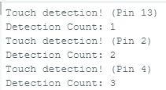
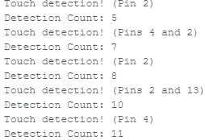
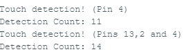
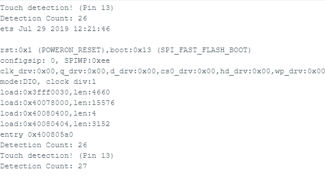

## ESP32 Touch Detector and counter using EEPROM

### Introduction
This project revolves around the use of the ESP-WROOM-32 touch modules within the pins of the microcontroller. The main purpose is to be able to use the touch sensors to detect specifically where (which pin) the detection occurred in and to increment the detection count from the EEPROM. This was done in the Arduino IDE in the language of C++. Ensure that the board can communicate with the Host on COM(1-5) in Serial Communication. Respective drivers for the communication may be needed. The project code can be found in its entirety on my github.

### Required Libraries
- esp32 by expressif (Board Library) <br>
- ArduinoJson by Benoit Blanchon <br>

### Code introduction and explaination

The code serves as foundational information to test the functionality of the touch module found within the pins of ESP32. To start off, we included the Arduino and EEPROM header files and defined the pins (2,4,13) to be the inputs of our program. An integer value (30) served as the threshold value for when a touch is detected by the pin, otherwise, bogus values with be given and attempted to be handled by the program which can lead to issues.

After giving the follow arguments, the address of EEPROM at 0 will reset to 0.
```cpp
EEPROM.write(0,0) // Or this can be initialized to a pin GPIO as a hard reset.
```

#### EEPROM Library

The main functions used in the program from the EEPROM library is EEPROM.begin(size) which sets the value saved data by integer "size" bytes. At the start of our loop(), Detections is set by the data found in address 0 of the EEPROM then it is printed in a String() parser. We used EEPROM.read(0) to read from address 0 and save it in the integer variable Detections. EEPROM.write(0, Detections) was used to overwrite the data in address 0 by the new incremented value of detections such that we may be able to conserve the count between resets. EEPROM.commit() is used to save the changed EEPROM.write() values between resets.

#### ESP32 base library

In the ESP32, I used the function touchread(pin) to read from the desired pins then print in the console the detection location accordingly.

### Running tests

Appending the pins into a 3 bit value:
```cpp
  //check if pins meet the threshold set (30). Anything below means there was a touch detection.
  if(t1 < STRONGTOUCH){
    TouchDetected |= (1<<0); // Bit 0: Pin 4
    }
  if(t2 < STRONGTOUCH){
    TouchDetected |= (1<<1); // Bit 1: Pin 13
    }
  if(t3  < STRONGTOUCH){
    TouchDetected |= (1<<2); // Bit 3: Pin 2
    }
  }
```

For handling multiple detections a switch case was implemented:
```cpp
   else{ // handles multiple detections at once.
    switch(TouchDetected){ //0b000: 2, 13, 4
```
#### Testing individual pins

- 1 second delay per touch detection
- System is in polling mode awaiting a touch to be read
- Strong touch only can be detected to avoid inconsistency and inaccurate reading



#### Double Pins

- Same as the individual pins but checking if the system can detect 2 simultaneous pin sensors.
- Detect count should increment by 2



#### All Pins

- Test if all pins can be detected simultaneously
- Detect count incremented by 3



#### EEPROM Detection Count Preservation

- Detection count should continue at the point it was before reset.
- Handle data integrity between resets



