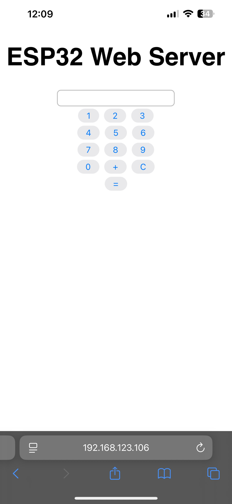
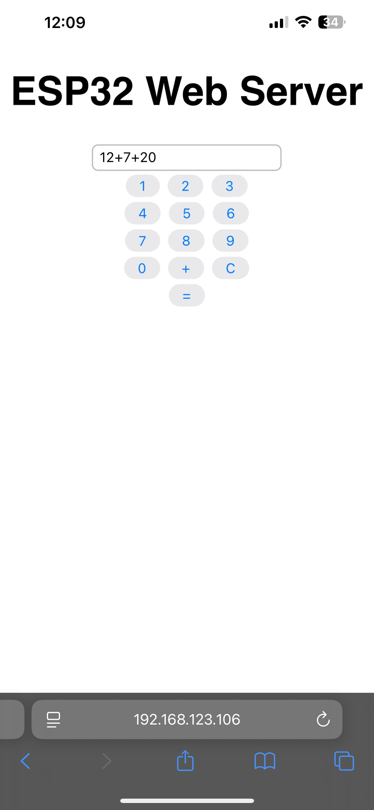
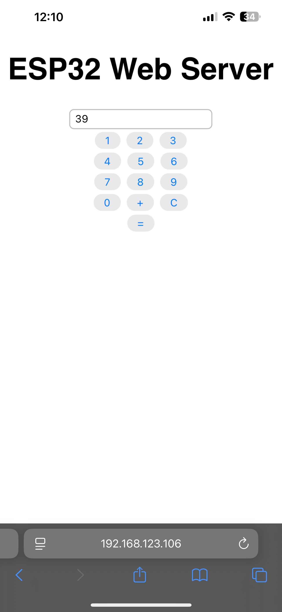

## ESP32 Web Server running a Basic Calculator
This project was made on the ESP-WROOM-32 as a basic functioning web server and a calculator. The main purpose is to demonstrate the capabilities of the WiFi module of the ESP32 to function as a local web server and to show that data can be sent/received on WiFi.

### Required Libraries

1) Async- AsyncEspFsWebserver by Tolentino <br>
2) ESPAsyncWebServer by lacamera <br>
3) esp32 by Espressif Systems (Board Library)<br>
4) Arduino ESP32 Boards by Arduino<br>

### WiFi Library Use

During setup, the "WiFi.begin(ssid, password);" function allows ESP32 to attempt to connect to a router using the WiFi library's begin() function. ssid and password will have to be replaced by your actual router ssid and router's password. <br>
while(WiFi.status() != WL_CONNECTED) will check if the board has successfully connected to the router, otherwise, it will stay idle while waiting for an ACK from the router. WiFi.localIP() will print out the local IP address of your ESP32 which you need to be able to connect to the web page from a host in the <b>SAME</b> network. After connection, we can initialize the server to wait for incoming connection requests using client as an object of class WiFiClient whenever the server is available. This is a boolean value that changes depending on the connectivity of the client to the web page. While the client is connected and is available to receive bytes from the server, a string header prints out the web page content using client.println() function where the printed out strings are HTML-based content which will generate the web page for the client that is connected.

### Console terminal

For security and testing purposes, a console will print any activities within the web page in the case of client connection and disconnection. For the initialization phase, the ESP32 Dynamic IP address will be printed where the user needs to input it on the host and connect to the IP address.

### Scripts (HTML)
Within the Arduino IDE, you may notice that we used HTML scripts. This is because we want to make the web page function as our intended calculator project. There are 3 important scripts/functions we added in the project: <br>
1) add(val) <br>
```cpp
client.println("function add(val) {");
client.println("  let display = document.getElementById('display');"); // Find display value
client.println("  if (val === '+') {resultShown = false;};"); // Add next digits 
client.println("  if (resultShown && val !== '+') {"); // User re-inputs different numbers, reset calculator
client.println("    display.value = '';");  // Clear previous result
client.println("    resultShown = false;"); // Result is not shown in display
client.println("  }");
client.println("  if (display.value === '' && val === '+') return;");  // Append '+' and first input and check if display is empty
client.println("  display.value += val;");                     
client.println("}");
```
<i>Takes the button input ids from the textbox and converts them to numbers which is then added to each other within the textbox</i> <br>

2) clearDisplay() <br>
```cpp
client.println("function clearDisplay() {");
client.println("  document.getElementById('display').value = '';"); 
client.println("  resultShown = false;");
client.println("}");
```
<i>Removes all text in the calculator's textbox</i> <br>

3) calculate() <br>

```cpp
          client.println("function calculate() {");
          client.println("  let input = document.getElementById('display').value;");
          client.println("  if (/^[0-9+]+$/.test(input)) {");
          client.println("    let result = input.split('+').reduce((a,b) => Number(a) + Number(b),0);");
          client.println("    document.getElementById('display').value = result;");
          client.println("    resultShown = true;");
          client.println("  } else {");
          client.println("    document.getElementById('display').value = 'Error';");
          client.println("    resultShown = true;");
          client.println("  }");
          client.println("}");
```

<i>Main function, calculates the added values and checks for validity of the inputs (Digits and '+' are the only whitlisted inputs)</i> <br>

### Running Test

#### Homepage of Web server
- Connected to the Dynamic IP of the Host Web Server
- IP may change between web server reboots
- Connection changes will affect the IP of host
- Inability for user to type in the results window



### Testing Multiple Input digits separated by "+"
- Testing different inputs of different sizes (digits)
- Testing the separation function due to "+"



### Final result of Calculation
- Display the sum in the textbox
- Allow for continuation of addition by inputting "+"
- Clear and remove displayed sum from memory if a digit was inputted



## ESP32 Touch Detector and counter using EEPROM

### Introduction
This project revolves around the use of the ESP-WROOM-32 touch modules within the pins of the microcontroller. The main purpose is to be able to use the touch sensors to detect specifically where (which pin) the detection occurred in and to increment the detection count from the EEPROM. This was done in the Arduino IDE in the language of C++. Ensure that the board can communicate with the Host on COM(1-5) in Serial Communication. Respective drivers for the communication may be needed. The project code can be found in its entirety on my github.

### Required Libraries
- esp32 by expressif (Board Library) <br>
- ArduinoJson by Benoit Blanchon <br>

### Code introduction and explaination

The code serves as foundational information to test the functionality of the touch module found within the pins of ESP32. To start off, we included the Arduino and EEPROM header files and defined the pins (2,4,13) to be the inputs of our program. An integer value (30) served as the threshold value for when a touch is detected by the pin, otherwise, bogus values with be given and attempted to be handled by the program which can lead to issues.

After giving the follow arguments, the address of EEPROM at 0 will reset to 0.
```cpp
EEPROM.write(0,0) // Or this can be initialized to a pin GPIO as a hard reset.
```

#### EEPROM Library

The main functions used in the program from the EEPROM library is EEPROM.begin(size) which sets the value saved data by integer "size" bytes. At the start of our loop(), Detections is set by the data found in address 0 of the EEPROM then it is printed in a String() parser. We used EEPROM.read(0) to read from address 0 and save it in the integer variable Detections. EEPROM.write(0, Detections) was used to overwrite the data in address 0 by the new incremented value of detections such that we may be able to conserve the count between resets. EEPROM.commit() is used to save the changed EEPROM.write() values between resets.

#### ESP32 base library

In the ESP32, I used the function touchread(pin) to read from the desired pins then print in the console the detection location accordingly.

### Running tests

#### Testing individual pins

- 1 second delay per touch detection
- System is in polling mode awaiting a touch to be read
- Strong touch only can be detected to avoid inconsistency and inaccurate reading


#### Double Pins

- Same as the individual pins but checking if the system can detect 2 simultaneous pin sensors.
- Detect count should increment by 2


#### All Pins

- Test if all pins can be detected simultaneously
- Detect count incremented by 3


#### EEPROM Detection Count Preservation

- Detection count should continue at the point it was before reset.
- Handle data integrity between resets


